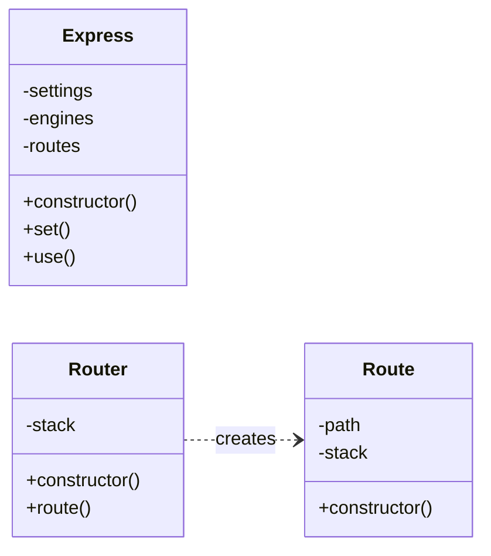

# 🏗️ Express.js - Mermaid

*Generated by Insight Suite JS2UML on 10/26/2025*

## 📊 Quick Stats

| Metric | Value |
|--------|-------|
| Classes | 3 |
| Methods | 6 |
| Quality Score | 100% |
| Relationships | 1 |

## 📐 Architecture Diagram

## 🏛️ Classes Details

### Express

**Methods (3):**
- `constructor()` 🏗️
- `set()`
- `use()`

**Properties (3):**
- `settings`
- `engines`
- `routes`

### Router

**Methods (2):**
- `constructor()` 🏗️
- `route()`

**Properties (1):**
- `stack`

### Route

**Methods (1):**
- `constructor()` 🏗️

**Properties (2):**
- `path`
- `stack`

